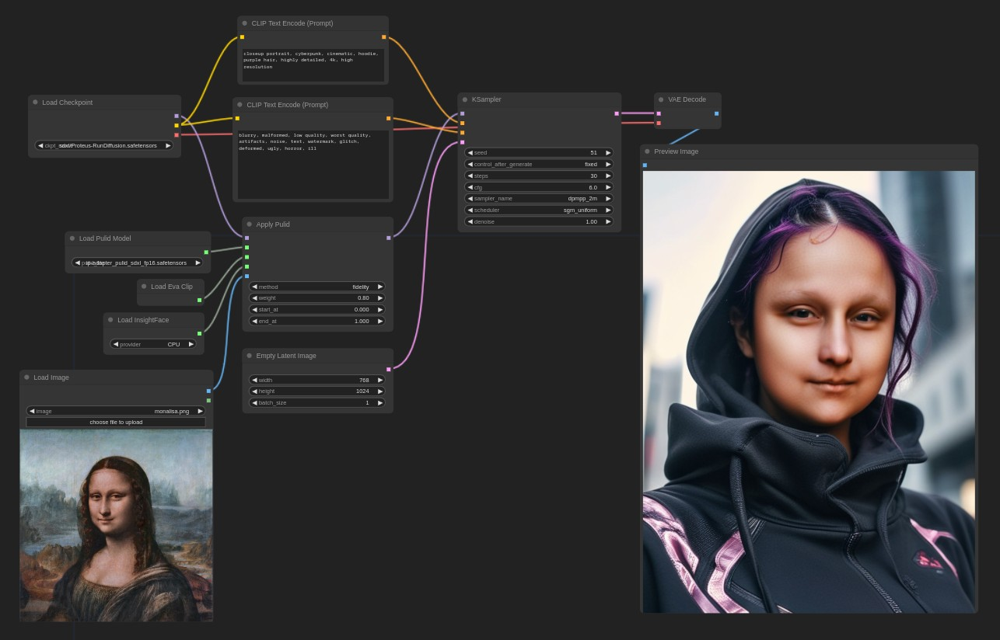

# PuLID ComfyUI native implementation

[PuLID](https://github.com/ToTheBeginning/PuLID) ComfyUI native implementation.

## Notes

This is a preliminary implementation. Things may change in the coming days. In the `examples` directory you'll find some basic workflows.

The original implementation makes use of a [4-step lighting UNet](https://huggingface.co/ByteDance/SDXL-Lightning). I made a few comparison tests with the official Gradio demo using the same model in ComfyUI and I can't see any noticeable difference, meaning that this code should be faithful to the orignal. The Lightning lora doesn't work as well.

Testing other models though I noticed some quality degradation. You may need to experiment with CFG and various samplers/schedulers (try `sgm_scheduler`).

**The quality of the reference image is very important**. Maybe this is because of the Eva CLIP that gets a lot more details. Be sure to use a clean and sharp reference!

**For IPAdapter compatibility you need to updated the IPAdapter extension!**

## The 'method' parameter

`method` applies the weights in different ways. `Fidelity` is closer to the reference ID, `Style` leaves more freedom to the checkpoint. Sometimes the difference is minimal. I've added `neutral` that doesn't do any normalization so the reference is very strong and you need to lower the weight.

## Installation

- [PuLID pre-trained model](https://huggingface.co/huchenlei/ipadapter_pulid/resolve/main/ip-adapter_pulid_sdxl_fp16.safetensors?download=true) goes in `ComfyUI/models/pulid/` (thanks to [Chenlei Hu](https://github.com/huchenlei) for converting them into IPAdapter format)
- The EVA CLIP is EVA02-CLIP-L-14-336, but should be downloaded automatically (will be located in the huggingface directory).
- `facexlib` dependency needs to installed, the models are downloaded at first use
- Finally you need InsightFace with [AntelopeV2](https://huggingface.co/MonsterMMORPG/tools/tree/main), the unzipped models should be placed in `ComfyUI/models/insightface/models/antelopev2`.

